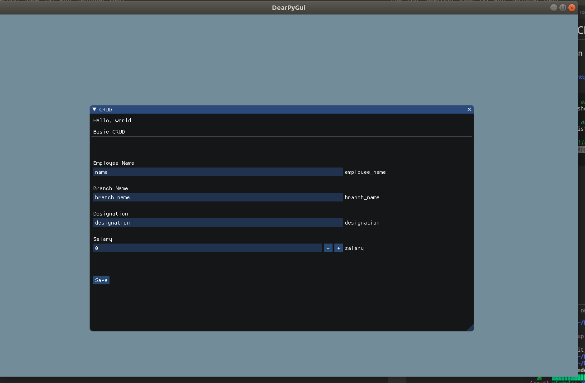

# Simple CRUD gui using dearpygui

## Installation

requirements:

- pipenv : https://pypi.org/project/pipenv/#:~:text=Usage%20Examples%3A%20Create%20a%20new,%2D%2Dpre%20Show%20a%20graph

```bash
# first
$ cd crud

# virutal environment
$ pipenv shell

# install dependencies inside Pipfile
$ pipenv istall

# run application
$ python app.js

```

## Preview



## example logs


